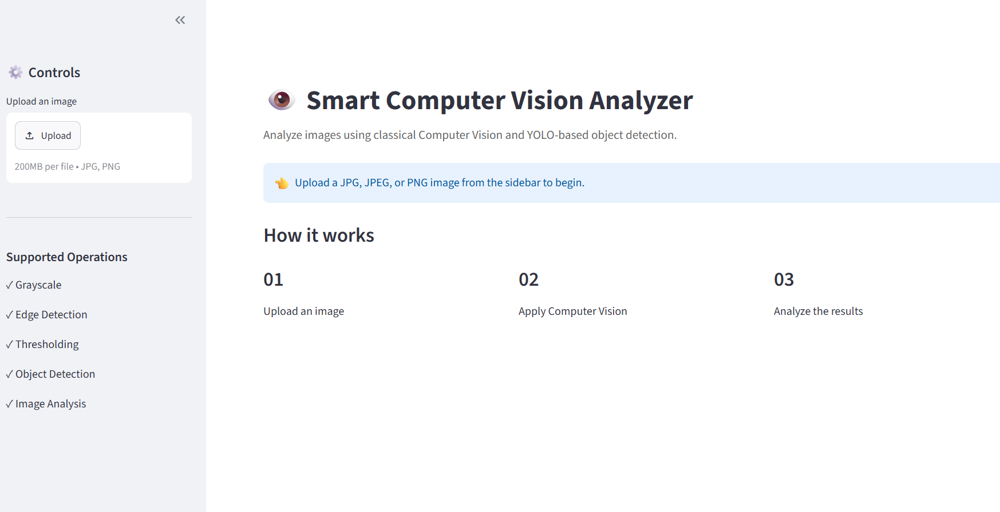
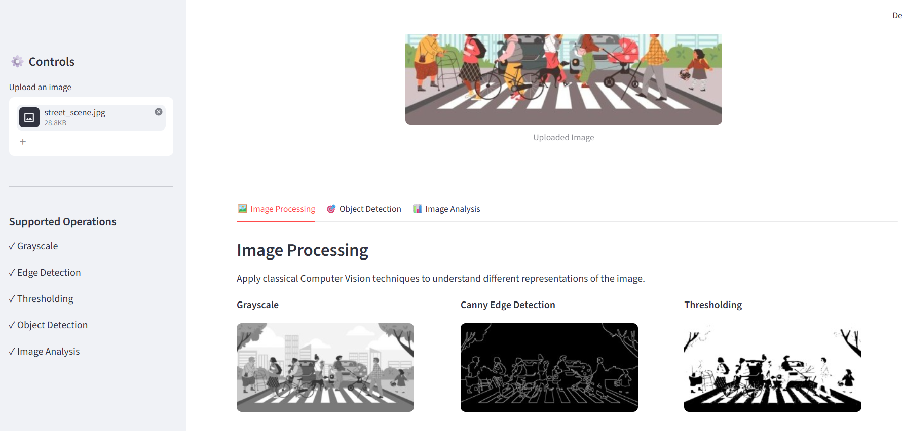
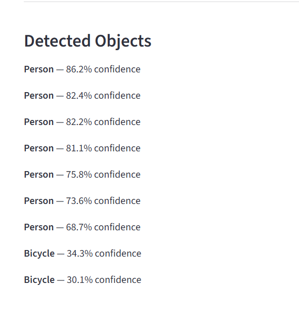
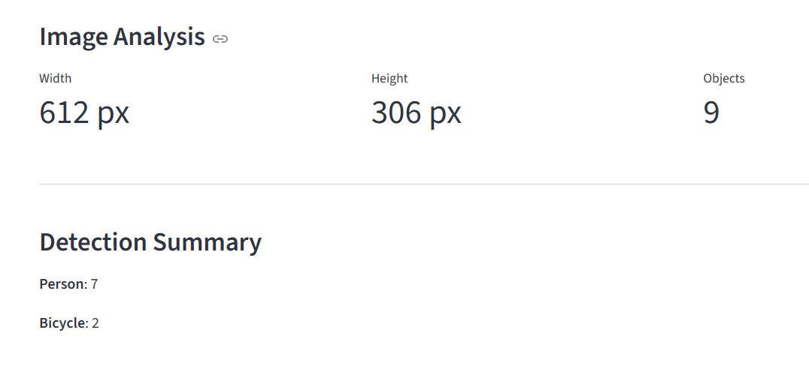
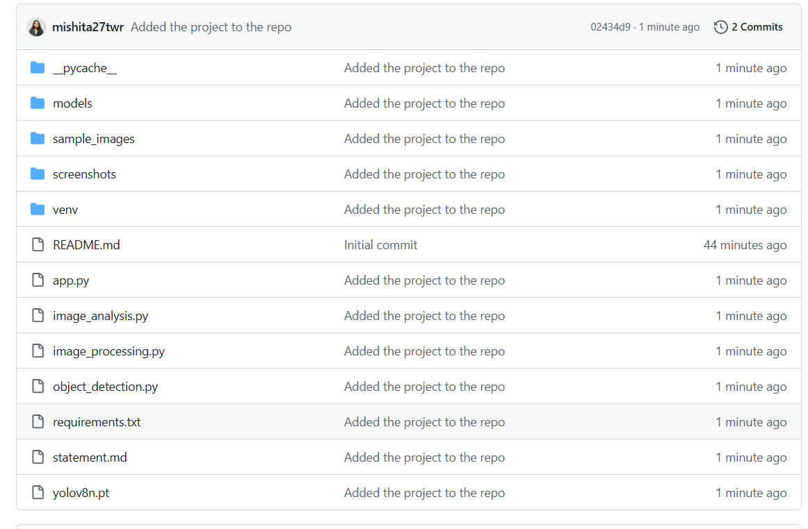
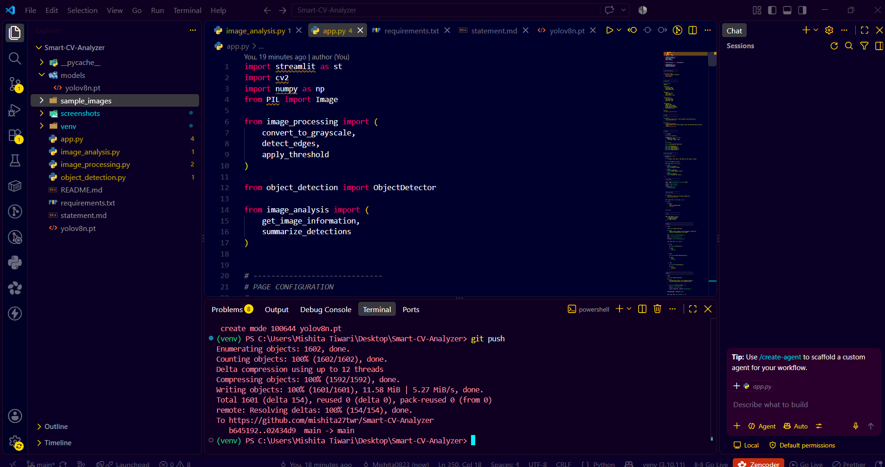

# 👁️ Smart Computer Vision Analyzer

### Computer Vision Project — VITyarthi Build Your Own Project

An interactive Computer Vision application that combines classical image processing, YOLO-based object detection, and image analysis into a single user-friendly interface.

---

## 👩‍🎓 Student Information

| Field                    | Details                            |
| ------------------------ | ---------------------------------- |
| **Student Name**         | Mishita Tiwari                     |
| **Registration Number**         | 24BAI10204                    |
| **Program**              | B.Tech CSE (AI/ML)                 |
| **University**           | VIT Bhopal University              |
| **Course**               | Computer Vision                    |
| **Project Type**         | VITyarthi — Build Your Own Project |
| **Domain**               | Computer Vision                    |
| **Programming Language** | Python                             |
| **Interface**            | Streamlit                          |

---

## 📌 Project Overview

**Smart Computer Vision Analyzer** is a Python-based Computer Vision application designed to demonstrate practical image-processing and object-detection techniques.

The system allows users to upload an image and perform multiple Computer Vision operations through a single Streamlit web interface.

The project combines classical Computer Vision techniques with a pretrained YOLO object-detection model.

### Key capabilities

* Grayscale conversion
* Gaussian filtering
* Canny edge detection
* Image thresholding
* YOLO object detection
* Bounding-box visualization
* Confidence-score analysis
* Object counting
* Image dimension analysis

---

# 🎯 Objectives

The main objectives of the project are:

1. To develop an interactive Computer Vision application.
2. To implement classical image-processing techniques using OpenCV.
3. To perform object detection using a pretrained YOLO model.
4. To analyze detected objects and image properties.
5. To provide a simple interface for interacting with Computer Vision algorithms.
6. To demonstrate modular software architecture and practical application of Computer Vision concepts.

---

# ✨ Features

## 🖼️ Module 1 — Image Processing

The application provides:

* Grayscale conversion
* Gaussian filtering
* Canny edge detection
* Binary thresholding

These techniques demonstrate fundamental image-processing operations.

---

## 🎯 Module 2 — Object Detection

The application uses a pretrained YOLO model to identify objects in uploaded images.

Features include:

* Object identification
* Bounding-box visualization
* Object labels
* Confidence scores
* Multiple-object detection

---

## 📊 Module 3 — Image Analysis

The application provides:

* Image width
* Image height
* Number of detected objects
* Detection summary
* Object frequency

---

# 🏗️ System Architecture

```text
                    ┌─────────────────┐
                    │      User       │
                    └────────┬────────┘
                             │
                             ▼
                  ┌────────────────────┐
                  │   Streamlit UI     │
                  └─────────┬──────────┘
                            │
             ┌──────────────┼──────────────┐
             │              │              │
             ▼              ▼              ▼
      ┌────────────┐ ┌─────────────┐ ┌─────────────┐
      │   Image    │ │   Object    │ │    Image    │
      │ Processing │ │  Detection  │ │   Analysis  │
      └──────┬─────┘ └──────┬──────┘ └──────┬──────┘
             │              │               │
             ▼              ▼               ▼
          OpenCV          YOLO           Statistics
             │              │               │
             └──────────────┼───────────────┘
                            ▼
                   ┌─────────────────┐
                   │  Result Display │
                   └─────────────────┘
```

---

# 🔄 Application Workflow

```text
START
  │
  ▼
Upload Image
  │
  ▼
Validate Image
  │
  ▼
Process Image
  │
  ├────────────────┐
  │                │
  ▼                ▼
Image Processing   Object Detection
  │                │
  ▼                ▼
Edges/Threshold    Bounding Boxes
  │                │
  └────────┬───────┘
           ▼
     Image Analysis
           │
           ▼
     Display Results
           │
           ▼
          END
```

---

# 🛠️ Technologies Used

| Technology      | Purpose                              |
| --------------- | ------------------------------------ |
| **Python**      | Core programming language            |
| **OpenCV**      | Image processing                     |
| **YOLO**        | Object detection                     |
| **Ultralytics** | YOLO implementation                  |
| **NumPy**       | Numerical and image-array operations |
| **Pillow**      | Image handling                       |
| **Streamlit**   | Web interface                        |
| **Git**         | Version control                      |
| **GitHub**      | Source-code repository               |

---

# 📂 Project Structure

```text
Smart-CV-Analyzer/
│
├── app.py
├── image_processing.py
├── object_detection.py
├── image_analysis.py
├── requirements.txt
├── README.md
├── statement.md
│
├── sample_images/
│   ├── street_scene.jpg
│   ├── animals.jpg
│   ├── traffic.jpg
│   ├── indoor_scene.jpg
│   └── single_object.jpg
│
└── screenshots/
    ├── 01_homepage.png
    ├── 02_image_processing.png
    ├── 03_object_detection.png
    ├── 04_image_analysis.png
    ├── 05_github_repository.png
    └── 06_project_structure.png
```

---

# ⚙️ Installation

## 1. Clone the Repository

```bash
git clone <https://github.com/mishita27twr/Smart-CV-Analyzer>
```

## 2. Navigate to the Project

```bash
cd Smart-CV-Analyzer
```

## 3. Create a Virtual Environment

```bash
python -m venv venv
```

## 4. Activate the Virtual Environment

### Windows

```powershell
venv\Scripts\activate
```

### macOS/Linux

```bash
source venv/bin/activate
```

## 5. Install Dependencies

```bash
pip install -r requirements.txt
```

---

# ▶️ Running the Application

Run:

```bash
streamlit run app.py
```

The application will open in the browser using the local Streamlit server.

---

# 🧪 How to Use

1. Launch the application.
2. Upload a JPG, JPEG, or PNG image from the sidebar.
3. Open **Image Processing** to view:

   * Grayscale
   * Canny Edge Detection
   * Thresholding
4. Open **Object Detection** to view:

   * Detected objects
   * Bounding boxes
   * Confidence scores
5. Open **Image Analysis** to view:

   * Image dimensions
   * Object count
   * Detection summary

---

# 🧠 Computer Vision Concepts Demonstrated

### Grayscale Conversion

Converts a color image into a single-channel grayscale representation.

### Gaussian Filtering

Smooths the image and helps reduce noise before edge detection.

### Canny Edge Detection

Identifies significant intensity changes to extract edges from an image.

### Thresholding

Converts a grayscale image into a binary representation based on an intensity threshold.

### Object Detection

YOLO identifies objects and predicts their locations using bounding boxes.

### Confidence Score

The detection model provides a confidence value associated with each predicted object.

---

# 🧩 Functional Requirements

| Requirement | Description                                                        |
| ----------- | ------------------------------------------------------------------ |
| **FR1**     | The system shall allow users to upload JPG, JPEG, and PNG images.  |
| **FR2**     | The system shall perform grayscale conversion.                     |
| **FR3**     | The system shall perform Canny edge detection.                     |
| **FR4**     | The system shall perform image thresholding.                       |
| **FR5**     | The system shall detect objects using YOLO.                        |
| **FR6**     | The system shall display bounding boxes and confidence scores.     |
| **FR7**     | The system shall calculate image dimensions and object statistics. |

---

# 🔐 Non-Functional Requirements

### Performance

The system should process uploaded images within a reasonable response time depending on image size and available hardware.

### Usability

The application provides a simple graphical interface that allows users to perform Computer Vision operations without command-line interaction.

### Reliability

The system should handle supported image formats and provide appropriate feedback when no image is uploaded or no objects are detected.

### Maintainability

Image processing, object detection, and image analysis are separated into independent Python modules.

### Scalability

Additional Computer Vision algorithms and detection models can be integrated into the modular architecture.

---

# 🧪 Testing

The application was tested using different types of images containing people, animals, vehicles, and indoor objects.

| Test Case | Input                            | Expected Result                                 |
| --------- | -------------------------------- | ----------------------------------------------- |
| TC01      | No image                         | Upload prompt displayed                         |
| TC02      | JPG image                        | Image successfully loaded                       |
| TC03      | PNG image                        | Image successfully loaded                       |
| TC04      | Image containing objects         | Objects detected with bounding boxes            |
| TC05      | Image with no recognized objects | Appropriate warning displayed                   |
| TC06      | Valid image                      | Grayscale, edge and threshold results generated |

---

# 📸 Screenshots

## 1. Home Page

The main interface provides the project title, upload control, supported operations, and application workflow.



---

## 2. Image Processing

The Image Processing module demonstrates grayscale conversion, Canny edge detection, and thresholding.



---

## 3. Object Detection

The Object Detection module uses YOLO to identify objects and display bounding boxes and confidence scores.



---

## 4. Image Analysis

The Image Analysis module displays image dimensions, number of detected objects, and detection summaries.



---

## 5. GitHub Repository

The project source code and documentation are maintained using Git and GitHub.



---

## 6. Project Structure

The project follows a modular structure separating the main application, image processing, object detection, and image analysis components.



---

# 🚧 Challenges Faced

Some of the challenges encountered during development include:

* Integrating multiple Computer Vision operations into a single application.
* Handling different image formats.
* Converting images between PIL, NumPy, and OpenCV formats.
* Integrating a pretrained YOLO model with Streamlit.
* Presenting detection results clearly.
* Maintaining a modular project structure.

---

# 📚 Learnings

The project provided practical experience with:

* Image representation
* Color-space conversion
* Image filtering
* Edge detection
* Thresholding
* Object detection
* Bounding-box visualization
* Confidence-score interpretation
* Python modular programming
* Streamlit application development
* Git and GitHub version control

---

# 🔮 Future Enhancements

Future versions of the project could include:

* Real-time webcam detection
* Video-based object detection
* Object tracking
* Image segmentation
* Multiple model selection
* Detection-result export
* Performance comparison between detection models
* Cloud deployment

---

# 📖 References

1. OpenCV Documentation
   https://docs.opencv.org/

2. Ultralytics Documentation
   https://docs.ultralytics.com/

3. Streamlit Documentation
   https://docs.streamlit.io/

4. NumPy Documentation
   https://numpy.org/doc/

---

# 👩‍💻 Project Details

**Project Title:** Smart Computer Vision Analyzer

**Student:** Mishita Tiwari

**Program:** B.Tech CSE (AI/ML)

**University:** VIT Bhopal University

**Course:** Computer Vision

**Project Type:** VITyarthi — Build Your Own Project

**Domain:** Computer Vision

**Technologies:** Python, OpenCV, YOLO, Ultralytics, NumPy, Pillow, Streamlit

**Version Control:** Git / GitHub

---

### ⭐ Project Summary

Smart Computer Vision Analyzer demonstrates the integration of classical Computer Vision techniques and modern object detection within a modular, interactive application. The system provides image processing, object detection, and image analysis capabilities through a unified user interface.
